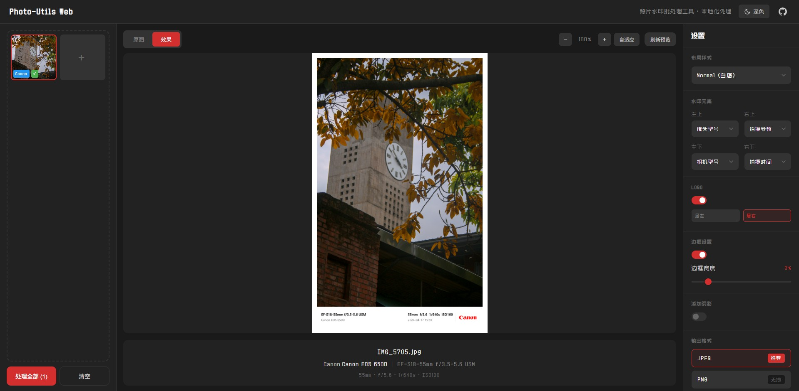

# Photo-Utils

一个基于浏览器的照片水印批处理工具，所有图片处理均在本地完成，无需上传服务器。

## 界面预览



## 功能特性

- 自动读取照片 EXIF 信息（相机型号、镜头、拍摄参数等）
- 多种水印布局样式（白底、黑红配色、简洁、1:1填充、背景模糊、白色边框）
- 自动识别相机品牌并显示对应 Logo
- 支持自定义水印文字
- 批量处理，打包下载
- 纯前端实现，隐私安全

## 本地部署

### 环境要求

- Node.js >= 16
- npm 或 yarn

### 安装步骤

```bash
# 克隆项目
git clone https://github.com/Kaery40/photo-utils.git
cd photo-mark

# 安装依赖
npm install

# 开发模式运行
npm run dev

# 构建生产版本
npm run build

# 预览生产版本
npm run preview
```

构建产物位于 `dist` 目录，可部署到任意静态服务器。

## Cloudflare Pages 部署

1. Fork 本仓库到你的 GitHub 账号
2. 登录 [Cloudflare Dashboard](https://dash.cloudflare.com/)
3. 进入 Workers & Pages > Create application > Get started
4. 授权并选择你 Fork 的仓库
部署完成后会自动分配一个 `*.pages.dev` 域名。

## 技术栈

- Vue 3 + Composition API
- Vite
- Canvas API
- exifr (EXIF 读取)
- JSZip (批量打包)
- FileSaver.js (文件下载)

## 项目结构

```
photo-mark/
├── public/
│   ├── fonts/          # 字体文件
│   └── logos/          # 品牌 Logo
├── src/
│   ├── components/     # Vue 组件
│   ├── styles/         # 样式文件
│   ├── utils/
│   │   ├── constants.js      # 常量配置
│   │   ├── exifReader.js     # EXIF 读取
│   │   └── imageProcessor.js # 图片处理
│   ├── App.vue
│   └── main.js
├── index.html
├── package.json
└── vite.config.js
```

## License

MIT

